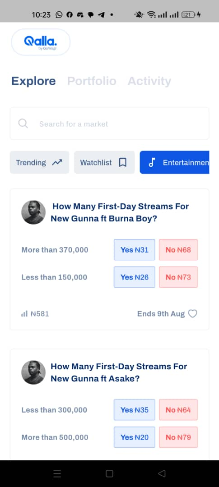
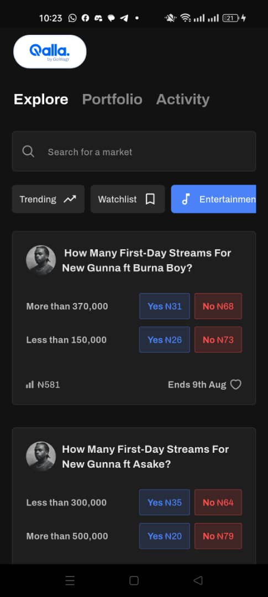

# Qalla Flutter Assessment

This application is a Flutter-based mobile app developed for the Gowagr Mobile Engineer assessment. It replicates the "Explore" tab of the Qalla app, fetching and displaying a list of public events from the provided API.

The project demonstrates a modern, scalable Flutter architecture, implementing key features such as an offline-first experience, manual pagination (infinite scroll), dynamic search, and category filtering.

## Video Demo

*(A video demonstrating the application's features and functionality will be added here.)*

## Screenshots

The application supports both light and dark themes, adapting automatically to the user's system settings.

| Light Mode                                     | Dark Mode                                    |
| ---------------------------------------------- | -------------------------------------------- |
|       |       |

## Features

-   **Pixel-Perfect UI**: The user interface is meticulously crafted to match the provided Figma design.
-   **Adaptive Theming**: **(Extra Feature)** The app includes full support for both Light and Dark modes, automatically switching based on the user's device display settings for a seamless experience.
-   **Offline-First Caching**: The app works seamlessly offline by serving cached data, ensuring a smooth user experience regardless of network connectivity.
-   **Infinite Scrolling**: Events are loaded in pages, and new events are fetched automatically as the user scrolls to the bottom of the list.
-   **Dynamic Search & Filtering**: Users can search for markets in real-time and filter events by category. The search and filter functionalities work in tandem.
-   **Robust State Management**: The UI correctly handles and displays loading, success, empty, and error states.
-   **Clean & Scalable Architecture**: The codebase is structured using Clean Architecture principles for maintainability and testability.

## Architecture & Folder Structure

The project adheres to **Clean Architecture** principles to ensure a clear separation of concerns, making the app scalable and easy to maintain. The codebase is organized by feature (`events`), with each feature's code divided into three distinct layers:

-   **Presentation Layer** (`lib/presentation`)
    -   Contains all UI-related logic and components, including Widgets, Pages, and the BLoC.
    -   State management is handled here using the **Flutter BLoC** package. The UI listens to state changes from the BLoC and rebuilds accordingly.

-   **Domain Layer** (`lib/domain`)
    -   Represents the core of the application, containing the business logic. It is completely independent of the other layers.
    -   **Entities**: Core business objects that are not tied to any specific data source implementation.
    -   **Repositories**: Defines abstract contracts (interfaces) for data operations, which are implemented by the Data Layer.
    -   **Use Cases**: Encapsulate individual business rules and orchestrate the flow of data from repositories to the Presentation Layer.

-   **Data Layer** (`lib/data`)
    -   Responsible for all data handling and retrieval. It implements the repository contracts defined in the Domain Layer.
    -   **Models**: Data Transfer Objects (DTOs) that are responsible for parsing JSON data from the API. They are separate from the domain entities.
    -   **Data Sources**: Provides a clear abstraction for fetching data, with separate implementations for remote (network) and local (database) sources.
    -   **Repository Implementation**: The `EventRepositoryImpl` class acts as the single source of truth for event data. It decides whether to fetch data from the remote API or the local cache based on network availability.

## State Management

State management is implemented using the **Flutter BLoC** package to create a predictable and structured data flow.

-   **`EventBloc`**: Manages the application's state by processing incoming events and emitting new states.
-   **Events** (`EventEvent`): These are triggered by UI interactions or lifecycle methods. Key events include:
    -   `FetchEvents`: Triggered for both the initial data load and for loading subsequent pages during pagination.
    -   `SearchEvents`: Triggered when the user types in the search bar or selects a new category.
-   **States** (`EventState`): Represents the UI's state at any given time, including `initial`, `loading`, `success`, and `failure`. It also holds the current list of events, pagination details, and filter/search keywords.

To optimize performance and avoid redundant API calls, the `SearchEvents` event uses a `debounceRestartable` transformer. This ensures that the API is only called after the user has stopped typing for 300 milliseconds, providing an efficient real-time search experience.

## Caching & Offline-First Experience

The application is built with an **offline-first** strategy, allowing users to access content even without an internet connection. This was achieved using the following tools and logic:

-   **Local Database**: **Drift** (a reactive persistence library for Flutter) is used to manage a local SQLite database.
-   **Networking**: **Dio** and **Retrofit** are used for making type-safe network requests to the REST API.
-   **Connectivity Check**: The `connectivity_plus` package is used to check the device's network status.

The caching logic in the `EventRepositoryImpl` follows this sequence:

1.  **Check Network**: Before fetching data, the repository checks if the device is connected to the internet.
2.  **Online Mode**: If there is a connection, it fetches the latest events from the remote API. Upon a successful fetch of the first page (and only if no search keyword is active), the new data is used to completely refresh the local database cache.
3.  **Offline Mode**: If there is no connection, the repository fetches the existing events directly from the Drift database and displays them to the user.

This approach ensures that the app is always responsive and functional, while also guaranteeing that the displayed data is up-to-date whenever possible.

## Decisions & Tech Stack

Several key decisions were made to meet the assessment's requirements while building a high-quality application.

-   **Tech Stack**:
    -   **State Management**: `flutter_bloc` for its robust and scalable pattern.
    -   **Networking**: `dio`, `retrofit`, and `json_serializable` for type-safe and efficient REST API communication.
    -   **Local Storage**: `drift` for a powerful, reactive, and type-safe SQLite implementation.
    -   **Dependency Injection**: `get_it` for simple and efficient service location.
    -   **Navigation**: `auto_route` for a clean and strongly-typed routing solution.

-   **Manual Pagination**: As required, pagination was implemented manually. A `ScrollController` is attached to the `ListView` to listen for scroll events. When the user scrolls near the end of the list, a `FetchEvents` event is dispatched to the BLoC to load and append the next page of data. A `hasReachedMax` flag is maintained in the `EventState` to prevent unnecessary API calls after all data has been loaded.

-   **Trade-offs**: The focus was placed on perfectly replicating the required UI and core functionalities. As a result, some data fields available in the API (such as `description`, detailed `rules`, and `status`) were not displayed in the UI, as they were not part of the Figma design. If this project were to be extended, the immediate next step would be to build an event detail screen to display this rich information.
